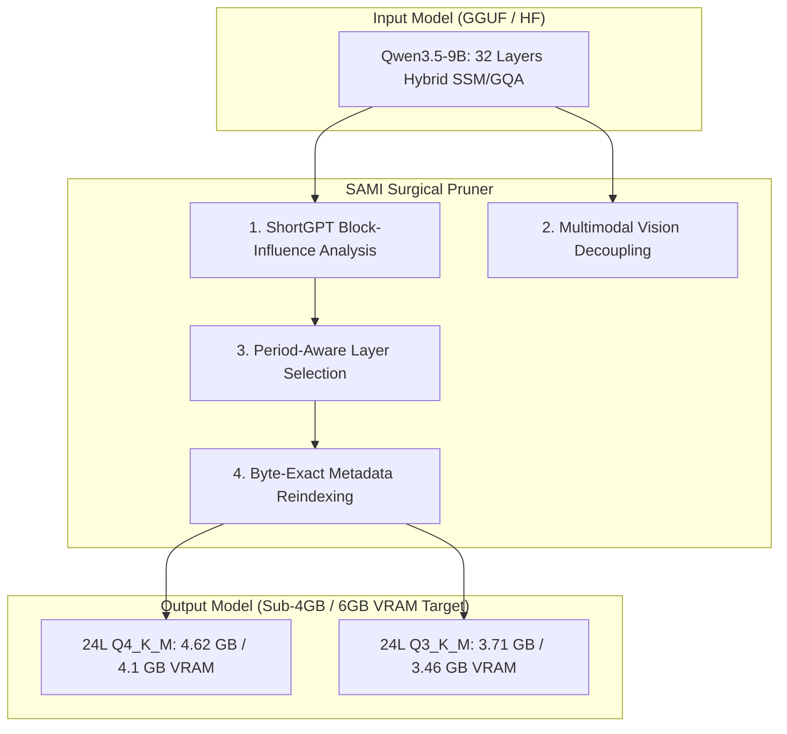

# SAMI Surgical Layer Pruner
### High-Performance Zero-Dequantization Block Dropper for Hybrid SSM & Transformer LLMs

[](https://www.python.org/downloads/)
[](LICENSE)
[](https://github.com/ggerganov/llama.cpp)
[]()

> **SAMI Surgical Pruner** is an ultra-fast, byte-exact layer pruning tool that drops redundant transformer/SSM blocks **directly on quantized GGUF binaries** (`Q4_K_M`, `Q5_K`, `Q8_0`, `F16`) without requiring model dequantization, weight reconstruction, or expensive re-training.

Developed by **Valentin Spiridon / TSV Consulting SRL** as part of the *Synapsa / Argos Distributed Ecosystem*.

---

## 🔬 Key Innovations

1. **Zero-Dequantization GGUF Pruning:**
   - Standard pruning tools require loading unquantized FP16 checkpoints into hundreds of gigabytes of RAM.
   - SAMI parses GGUF binary chunks directly, slices out unneeded layer blocks, re-indexes remaining tensor metadata, updates KV parameters (`block_count`), and re-aligns byte streams at disk I/O speed (~15 seconds for a 9B model).
2. **Periodic SSM/GQA Alignment:**
   - Modern hybrid models like **Qwen3.5** interleave recurrent State-Space blocks (Mamba-2) with Full Attention (GQA) in fixed periodic intervals (e.g., 3:1).
   - SAMI automatically identifies architectural periods and drops complete periodic intervals from the middle of the network, preventing KV-cache phase misalignment and token collapse.
3. **Decoupled Multimodal Vision Extraction:**
   - Excises heavy visual projection modules (`model.visual.*`) to separate standalone checkpoints, saving ~870 MB of dead VRAM for text-only workflows.

---

## 📊 Empirical Benchmarks: Qwen3.5-9B

Tested on **consumer hardware (NVIDIA GPU with 5.5 GB VRAM budget)** using native `llama-server.exe` with full GPU offload (`-ngl 99`, context window `2048` tokens):

| Model Variant | Layers | Quantization | Disk Size | VRAM Usage | Speed (GPU) | Coherence (EN / RO / Code) |
|---|:---:|:---:|:---:|:---:|:---:|
| **Qwen3.5-9B Original** | 32L | BF16 | 19.3 GB | ~19 GB | — | Baseline |
| **Qwen3.5-9B Official GGUF** | 32L | Q4_K_M | 5.29 GB | ~4.5 GB | ~20 tok/s | Baseline |
| **🏆 Qwen3.5-9B SAMI-Pruned** | **24L** | **Q4_K_M** | **4.62 GB** | **4.11 GB** | **21.5 tok/s** | **✅ 100% Coherent** |
| **🚀 Qwen3.5-9B SAMI Ultra-Slim** | **24L** | **Q3_K_M** | **3.71 GB** | **3.46 GB** | **17.7 tok/s** | **✅ 100% Coherent** |
| ~~Qwen3.5-9B Over-Pruned~~ | ~~20L~~ | ~~Q4_K_M~~ | ~~3.83 GB~~ | ~~3.7 GB~~ | — | ❌ Repetitive Collapse |

> [!NOTE]
> Pruning 8 layers (dropping periods 3 & 4: layers 12–19) reduces active parameter count from **9.46B to 7.09B**, yielding a **25% reduction in FLOPs per token** and leaving **~2.0 GB VRAM completely free** on 6GB GPUs.

---

## 🏛 Architecture Diagram



---

## 🚀 Quickstart

### 1. Installation
```bash
git clone https://github.com/MIThriade/sami-surgical-pruner.git
cd sami-surgical-pruner
pip install -r requirements.txt
```

### 2. Inspect Model Architecture
Inspect any GGUF file to see tensor counts, block structure, and attention periods:
```bash
python sami_gguf_layer_pruner.py --model Qwen3.5-9B-Q4_K_M.gguf --info-only
```

### 3. Prune GGUF Layers Directly (Zero Dequantization)
Drop 2 periods (8 layers) from the network center in seconds:
```bash
python sami_gguf_layer_pruner.py \
    --model Qwen3.5-9B-Q4_K_M.gguf \
    --output Qwen3.5-9B-24L-Q4_K_M.gguf \
    --drop-periods 2
```

Or drop specific layers by index:
```bash
python sami_gguf_layer_pruner.py \
    --model model.gguf \
    --output model_pruned.gguf \
    --drop-layers 12,13,14,15,16,17,18,19
```

### 4. Benchmark Model on GPU
Verify VRAM consumption, generation speed, and multilingual coherence:
```bash
python benchmark_gpu.py Qwen3.5-9B-24L-Q3_K_M.gguf 99 2048
```

---

## 📄 License & Commercial Rights

This software is released under the **PolyForm Noncommercial License 1.0.0**:
- **Free for noncommercial use:** Personal study, academic research, education, and hobbyist experimentation.
- **Commercial use prohibited without license:** Integrating into commercial SaaS, enterprise products, paid cloud services, or internal company workflows requires an enterprise commercial license.

For commercial licensing inquiries, contact:
* **Spiridon Valentin** / **TSV Consulting SRL**
* Timișoara, Romania

---

## 📚 Citation

If you use SAMI Surgical Pruner in your research or project, please cite:

```bibtex
@software{sami_surgical_pruner2026,
  author = {Spiridon, Valentin},
  title = {SAMI Surgical Layer Pruner: Zero-Dequantization Block Dropper for Large Language Models},
  year = {2026},
  publisher = {TSV Consulting SRL},
  url = {https://github.com/MIThriade/sami-surgical-pruner}
}
```
